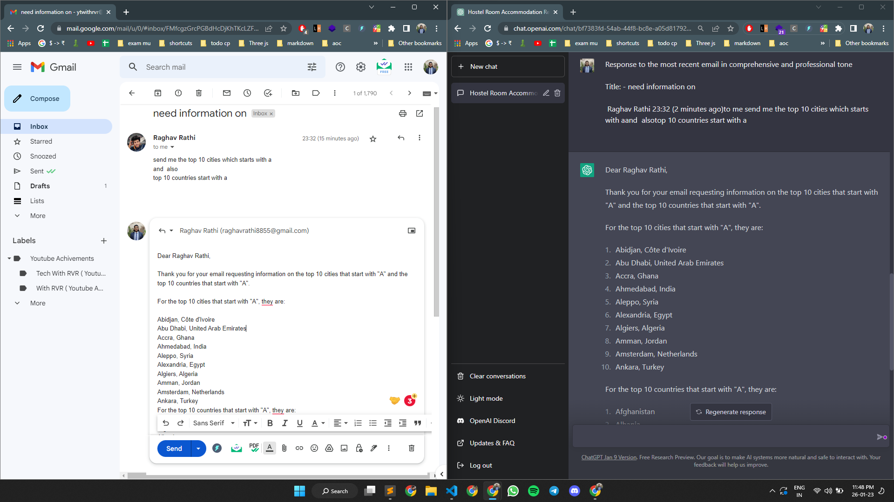
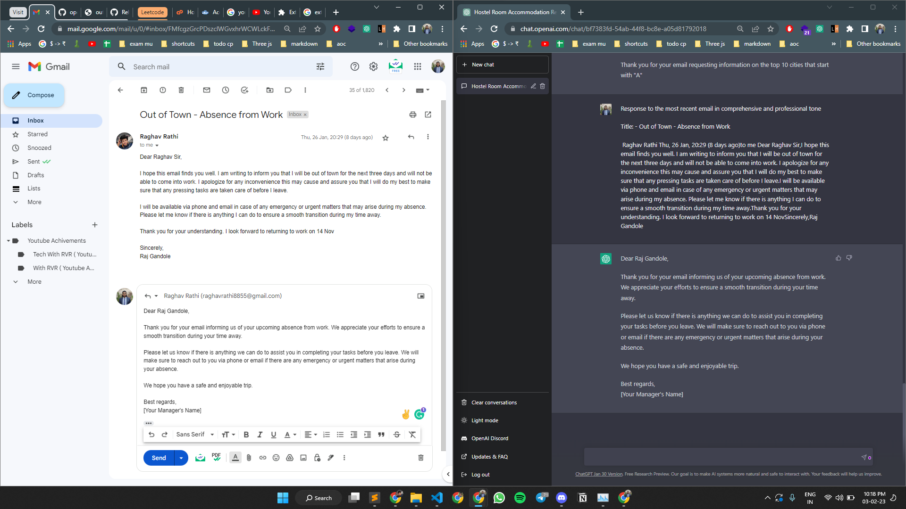
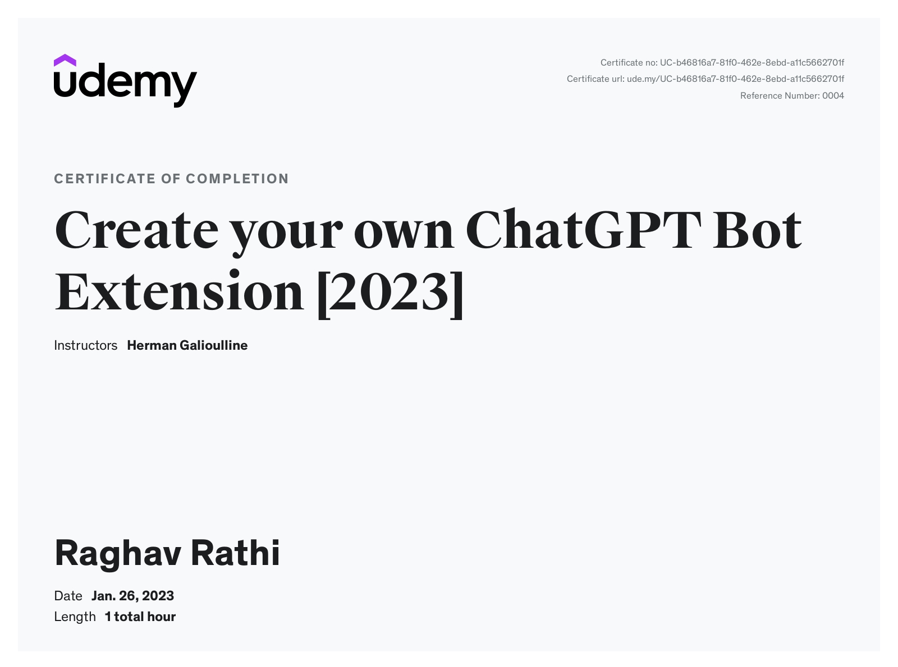

  

<h3 align="center"> <b>ChatGPT Gmail Bot</b> </h3>

  
 Chrome Extension to connect ChatGPT with gmail,   and write reply email for incoming emails 

<a href="https://github.com/withrvr/ChatGPT-Gmail-Bot/issues/new?template=bug_report.md" target="_blank">Report Bug</a>
|
<a href="https://github.com/withrvr/ChatGPT-Gmail-Bot/issues/new?template=feature_request.md" target="_blank">Request Feature</a>
|
<a href="https://github.com/withrvr/ChatGPT-Gmail-Bot/discussions" target="_blank">Discussions</a>

<!-- <h3 align="center">
   <a href="./screenshots/" target="_blank"><b>Screenshots of this project</b></a>
</h3> -->

# 📸: Screenshots of this projects

- How to run the project ... [Developer_Guide.md](./Developer_Guide.md)
- for more photos visit [/screenshots](./screenshots/) folder

<!--  -->

# 🔗: Links

- [Official Chrome Extension Docs](https://developer.chrome.com/docs/extensions/)
<!-- - Deployed extension link here -->
- Course :- https://www.udemy.com/course/chatgpt-bot/
- Certificate :- https://www.udemy.com/certificate/UC-b46816a7-81f0-462e-8ebd-a11c5662701f/

# ⚠️: NOTE

- very basic version / Side project
- but its a working model
- so there are some limitations
  1. reply button works but reply icon don't work
     - which is help fully also if ... you don't want to response ... but if ChatGPT is open
  2. have to reopen individual mail if reply button is clicked ones for it
  3. https://chat.openai.com/ :- should be open in one tab
     - nice i guess: so if not opened we don't want to use it right now
  4. ...
